```{r load-packages, include = FALSE}
library(dplyr)
library(ggthemes)
library(kableExtra)
library(knitr)
library(rticles)
library(sf)
library(spdep)
library(tidyverse)
library(units)
library(sp)
library(ngram)
library(float)
```

```{r package-bib, include=FALSE}
# This function is used to write a bibliography for the `R` packages used in the paper
knitr::write_bib(file = 'packages.bib')
```


  ***Background***: Cycling is known to have many health benefits. For this reason, transport planners and public health officials in Canada increasingly aim to encourage cycling for transport. On- and off-street infrastructure is often implemented to facilitate cycling and planners rely on a range of tools for informing the design of the network of facilities. This mixed methods study compares objectively measured attributes and cyclists' perceptions of the built environment along inferred cycling routes in Hamilton, Ontario.  
  ***Methods***: Environmental audits were conducted along six cycling routes in Hamilton to document the attributes that might support or hinder cycling. The routes were inferred based on the output of a model of cycling flows. Cyclists, 9 male and 5 female, then participated in semi-structured interviews where they reviewed photos of the routes and described their perceptions and preferences. Interview data were analyzed using both inductive and deductive thematic analysis based on the categories of the audit instrument.  
  ***Results***: Cyclists prefer routes that have dedicated cycling infrastructure, or residential streets with low volumes of traffic even if they lack infrastructure. They dislike routes with busy arterial roads or that lack cycling infrastructure. Their experience and knowledge of cycling in a city transitioning to be more bicycle-friendly revealed preferences that can help to improve existing infrastructure and cycling routes, which may also help to reduce barriers for non-cyclists.  
  ***Conclusions***: The use of photos is an innovative and practical approach to explore perceptions of regular cyclists, which can be leveraged to inform policies and interventions to make cycling routes and infrastructure safer and more attractive. Transport planners in developing cycling cities should pay attention to a broad range of built environment factors that influence where people choose to cycle.  

\newpage

Introduction {#sec:introduction}
==========================

Many Canadian cities have adopted pro-cycling policies and programs in recent years to support the uptake of cycling for transport, including a range of interventions from investments in infrastructure to educational programs or promotional events  [@assuncao-denisIncreasingCyclingTransportation2019a]. Large population health gains [@celis-moralesAssociationActiveCommuting2017b] and improved environmental conditions in urban areas [@zahabiExploringLinkNeighborhood2016b] could be achieved if cycling became more mainstream. For instance, Raustrop and Koglin [-@raustorpPotentialActiveCommuting2019] estimated that if nearly half of the residents in Scania county, Sweden cycled to work, almost 20 percent would meet physical activity guidelines from utilitarian travel alone. The challenge, however, is how to successfully transition from commonly car-centric North American cities, to bicycle-friendly cities with larger shares of active travel.

Active travelers seem to derive intrinsic value from their travel experience [@whalenModeChoice2013]. Moreover, travelers also tend to associate values such as freedom, enjoyment, and happiness with active travel, even if their regular mode of travel is not active [@mellaDoDrivers2021]. However, to convince people to cycle it is necessary to create social and built environments that are bicycle-friendly, and also improve the perception of those environments [@jamalPerceptions2020]. Short distances are ideal for cycle trips, which makes compact mixed-used areas attractive for cycling [@handyMakingUSCities2020; @pucherMakingCyclingIrresistible2008]. Streets with slow traffic and traffic calming devices can also encourage people to use the bicycle for transport [@mertensBuiltEnvironmentalCorrelates2017]. Other features such as adequate lighting and greenery have been found to support or motivate cycling [@wintersMotivatorsDeterrentsBicycling2011], in addition to increased address and street density [@gaoRoleNaturalBuilt2018]. Furthermore, cycling experts from both The Netherlands and New Zealand agree that cycling infrastructure is a universal prerequisite in countries with an established culture of cycling for transport and in countries with low levels of cycling [@adamPlanningCyclingDispersed2020]. 

Likely for this reason, cities where cycling is less mainstream have started building infrastructure to encourage more cycling. The case of Seville, Spain is a great example of the success that can be achieved by implementing a network of connected facilities at a rapid pace [@marquesHowInfrastructureCan2015a]. Revealed and stated preference studies have been further informative about the types of environments that cyclists prefer and have reinforced that cycling infrastructure is fundamentally important. Using global positioning system (GPS) data, several studies have found that cyclists travel routes that have on-street and off-path cycling facilities and streets with low volumes of traffic [@broachWhereCyclistsRide2012; @dillBicyclingTransportationHealth2009; @luUnderstandingBikeShare2018; @misraModelingCyclistRoute2018; @scottRouteChoiceBike2021]. Stated preference studies also indicate that cyclists dislike mixing with traffic and prefer dedicated infrastructure [*inter alia*, see @clarkUserPreferencesBicycle2019a; @caulfieldDeterminingBicycleInfrastructure2012; @stinsonCommuterBicyclistRoute2003; @veilletteDoesOneBicycle2019; @wintersMotivatorsDeterrentsBicycling2011]. 

Cities with low but growing levels of cycling have been called "developing cycling cities" [@liuWhatMakesGood2020], "low cycling maturity" cities [@felixMaturingUrbanCycling2019], "emerging cycling cultures" [@clarkUserPreferencesBicycle2019a], or "starter cycling cities" [@meirelesDigitalPlatformMobile2020]. People who currently cycle in these settings are in the unique position of observing and experiencing how the city changes over time to become more bicycle-friendly. Their experiences can highlight the extent to which a city's current efforts support or hinder cycling. A few studies in developing cycling cities have found a similarity in route preferences and barriers to cycling between cyclists and non-cyclists [see @felixMaturingUrbanCycling2019; @clarkUserPreferencesBicycle2019a; @wintersRoutePreferencesAdults2010] which also suggests that the perspectives of regular cyclists may also be informative about what could be improved to encourage more people to cycle. 

A variety of qualitative methods that examine the experience and perceptions of cycling in such settings can help to centre the cycling experience in route and infrastructure design. For example, interviews or mapping exercises [see @mantonUsingMentalMapping2016; @marquartPlannedPerceivedCity2020] and ride-alongs [@vanduppenRetracingTrajectoriesEmbodied2013] may shed more light on reasons for where people cycle and how cycling is experienced. Other methods that hold promise for cycling research are photovoice and photo elicitation, techniques that have been used to explore the link between transportation and well-being [@guellPicturingCommutingPhotovoice2015; @wardInfluenceTransportWellbeing2015] and perceptions of the built environment [@alexanderViewsNeighbourhoodPhotoElicitation2013; @bornioliPsychologicalWellbeingBenefits2018]. These approaches involve the use of images or photographs in qualitative interviews to evoke memories, feelings, and experiences about a research phenomenon [@harperTalkingPicturesCase2002]. Photo elicitation is well-suited for prompting discussion and developing a comprehensive description of cycling issues, and builds upon the use of photos in stated preference surveys [see @clarkUserPreferencesBicycle2019a] by enabling participants to recall and share perceptions or experiences that influence travel preferences. Environmental audits can also be a useful tool to document how the built environment supports active travel [@moudonWalkingBicyclingEvaluation2003], and have been used in studies to explore walkability. Qualitative evidence captured from photo elicitation or interviews can thus complement objective assessments of the physical environment studied through methods like environmental audits or GIS [see @leePerceptionsWalkabilityDeterminants2018], and has the potential to inform mobile applications or platforms to induce cycling [see @meirelesDigitalPlatformMobile2020].

In this paper, a sequential explanatory mixed methods approach compares objectively measured attributes and cyclists' perceptions of the built environment along inferred cycling routes in Hamilton, Ontario. This project explored the influence of the built environment on cycling in a mid-sized Canadian city with low but growing cycling levels. We previously estimated a spatial interaction model to investigate the correlates of cycling in Hamilton and found that the *quietest* distance route between cycling trip zones of origin and destination inferred by *CycleStreets* best explained cyclist travel in Hamilton and led to the most parsimonious model [paper submitted to *Transportation*]. Given that the routes were inferred, we did not know the quality of their built environment or how well they match where cyclists actually travel in Hamilton. To further explore these objectives, we audited 6 inferred routes to document attributes that might influence cycling. We then used photos of the routes, or photo-journeys, in 14 semi-structured interviews with regular cyclists to examine their perceptions of the routes. 

Methods, Research Setting, and Materials {#sec:methods}
=========================================

## Research Setting

Hamilton is a mid-sized city located in Canada with a population of roughly 740,000 according to the 2016 Canadian Census [@Statistics2016]. The city is relatively flat but is separated by the Niagara Escarpment, referred to locally as "the mountain", which can be as high as 100m in many places. The rural and suburban parts of the city are on top of the Escarpment and the lower city and downtown core are below [see Figure 1 for reference]. Similar to other Canadian cities, cycling levels have grown in recent years; the mode share of cycling for transport doubled from 0.6% in 2011 to 1.2% according to the 2016 *Transportation Tomorrow Survey* (*TTS*) [@Dmg2018tts]. This voluntary travel survey is conducted every 5 years to collect information about urban travel for commuting purposes in Southern Ontario [@Dmg2018tts]. Between the 2011 and 2016 surveys, the City of Hamilton implemented a public bicycle share program (PBSP) and added 85 kilometres of bicycle lanes. Hamilton is the only mid-sized city in Canada with a PBSP which reflects that the City has invested a lot of effort in the potential for Hamilton to become a mid-sized cycling city in North America. As of 2019, approximately 46% of the cycling network has been built and approximately 15 to 20 km of new facilities are added each year. The City's current Cycling Master Plan states that the goal is to implement all proposed infrastructure by 2029 [@Cmp2009], but the City's typical annual investment in cycling infrastructure falls short of what is needed to meet this goal. Therefore, it is suggested that Hamilton is a developing cycling city because it is currently in a state of transition and has growing cycling levels. The City is at the mid-way point in the development of its cycle infrastructure network. Other interventions have been implemented to increase cycling levels, but the cycling culture is still growing and the network is currently fragmented. 

This paper contributes to the growing body of research on cycling and active travel in mid-sized Canadian cities in recent years [@fischerWhatDoesCrowdsourced2020; @klicnikPerspectivesActiveTransportation2019; @mayersWhoseLaneIt2020; @wintersImpactsBicycleInfrastructure2018]. Mid-sized cities in Ontario offer unique opportunities for future growth and development despite but face existing challenges to transportation and land use planning [@evergreenleveraging2017]. In the case of Hamilton, efforts to increase pedestrian and cyclist-friendly spaces are constrained by the city's efforts in the mid-1900s to prioritize automobile traffic on arterial roads [@leanagereorientingmidsized2017]. Despite the legacy of Hamilton's car-oriented streets, building a cycling network in mid-sized cities is promising because of short trip distances [@wintersImpactsBicycleInfrastructure2018], which can make cycling appealing given the proper investment in supportive infrastructure. Indeed, further analysis of the 2016 *TTS* revealed that 35% of all current trips in Hamilton are 5 km or less [@Mitra2016], which means that these trips could be cycled. The City of Hamilton also aims to have 15% of the mode share be comprised of walking and cycling trips by 2031 [@Tmp2018]. In this stage of transition, there is the potential to incentivize modal shifts that specifically increase opportunities for physical activity.

```{r figure-1, echo=FALSE, fig.align = 'center', out.width = "0.65\\linewidth", fig.cap = "The number of cycle trips reported for each traffic analysis zones in the city of Hamilton that produced cycle trips. The number of cycle trips (ranging from more than 1 to over 1097) are shown by the colour gradient. Most cycle trips reported occur around the University."}
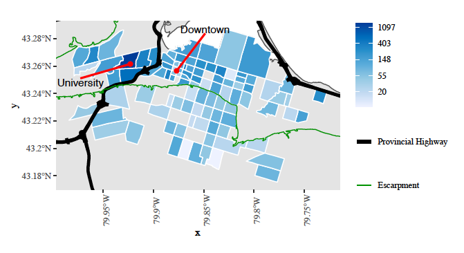
```

## Previous Research

In the first phase of this project, [paper submitted to *Transportation*], we used bicycle trip data from the 2016 *TTS* to develop a spatial interaction model that investigated the built environment correlates of cycling flows in Hamilton. While the *TTS* is informative about the traffic zones of origin and destination of cycling trips, it does not reveal the route choice of respondents. Thanks to the growth in open source resources for transportation analysis [@lovelaceOpenSource2021], a novel feature of this model was the use of a cycle routing algorithm to infer different types of cycle routes between zones of origins and destinations [@Lovelace2018]. The centroid of each traffic analysis zone, the geographical unit of analysis used by the *TTS*, serves as the start and end point for these inferred routes. The distance and time of three different types of routes, characterized as *fastest*, *quietest*, or *balanced* by the *CycleStreets* algorithm, were used as measures of impedance in the model. Briefly, the [`R` package](https://cran.r-project.org/web/packages/cyclestreets/index.html) states, “These represent routes taken to minimize time, avoid traffic, and compromise between the two, respectively” [@Lovelace2018, p. 1]. Additional details about the algorithm are available [online](https://www.cyclestreets.net/help/journey/howitworks/). The model revealed that inferred *quietest* routes that allow cyclists to minimize distance and interactions with other road users best explain the pattern of travel by bicycle in Hamilton [paper submitted to *Transportation*]. The *quietness* score takes into account attributes of the road, mainly the presence or absence of cycle infrastructure. Our findings suggests that cyclists in Hamilton are seeking out routes that enable them to avoid traffic while potentially maximizing the use of residential streets over arterial roads. We then used the model to identify trip flows where there was more or less cycling than expected (i.e., reported number vs. predicted number of cycle trips). The model did not capture any route-level characteristics beyond the data available for Hamilton through *OpenStreetMap* that was used by the algorithm. Therefore [see @moniruzzamanModelbasedApproachSelect2012], it was hypothesized that more cycling occurred between zones of origin and destination that were under-estimated because the inferred routes facilitate cycling (meaning that there was *more* cycling between the zones than predicted by the model), for example through the provision of infrastructure. Conversely, cycling trips may have been over-estimated if routes between zones of origin and destination are less supportive of cycling (meaning that there was *less* cycling between zones than predicted by the model).

## Methods

### Environmental Audits

We conducted environmental audits along 6 inferred routes that were most substantially over- or under-estimated by the model. The *Systematic Pedestrian and Cycling Environmental Scan* (*SPACES*)^[[SPACES Audit Instrument](https://activelivingresearch.org/sites/activelivingresearch.org/files/SPACES_Audit_Instrument_0.pdf)] [@pikoraDevelopingReliableAudit2002] was selected because it documents the presence or absence of observable characteristics that are potential influences of walking and cycling. The framework describes four domains of the built environment that influence physical activity: functional, safety, aesthetic, and destination [@pikoraDevelopingFrameworkAssessment2003]. The instrument was developed for use along street segments within neighbourhoods around a residential location. While the cycling trip flows in Hamilton occur beyond the 400 m neighbourhood range, our unit of analysis, namely segments of a street, is the same as the *SPACES Instrument*. The instrument also includes an extensive range of measurable features that have been identified in the literature which meet our objective in conducting an exploratory and descriptive analysis of attributes along the inferred cycling routes. For these reasons, we determined that the *SPACES Instrument* was suitable for our purposes. This instrument was also selected because it is relatively simple to use and developed for research purposes [@moudonWalkingBicyclingEvaluation2003]. The instrument comes from the field of health and the factors included in the audit were guided by stakeholder interviews and a Delphi study [@pikoraDevelopingFrameworkAssessment2003].

The *SPACES Instrument* was adapted to the local context in Hamilton. Cycling was the primary focus of this study; accordingly, some factors that were less influential on cycling, according to the literature, were removed for ease of data collection. The features that were removed from the instrument used in this study include: *permanent path obstructions*, *pedestrian crossing aids*, *surveillance*, *building design*, and *driveway crossovers*. Other features were combined: all types of maintenance instead of specific categories, and the types of paths. A broader range of cycling facilities, buildings, and traffic calming measures that are found in Hamilton were also added. The modified *SPACES Instrument* is shown in Appendix A and the Hamilton cycling guide added to the *SPACES Observation Manual* is found in Appendix B. The first author and three research assistants conducted the audits during October and November 2019. The first author was the only auditor who has cycling experience in Hamilton. Each auditor participated in a training exercise led by the first author to become familiar with the *SPACES Instrument* and the *SPACES Observation Manual*^[[SPACES Observation Manual](https://activelivingresearch.org/sites/activelivingresearch.org/files/SPACES_Observation_Manual.pdf)] [@pikoraDevelopingReliableAudit2002], and to standardize the way in which the audits were carried out. The majority of routes ($n = 4/6$) were audited by a pair of research assistants who filled out the instrument together. Two routes ($n = 2/6$) were audited by the first author alone. The auditors were instructed to discuss any disagreements and reach consensus before filling out the instrument. Once the audits were completed, the features of each route segment were manually recorded in an Excel sheet by the first author. Any perceived errors in data collection were reviewed using Google Street View and were corrected by the first author. A descriptive analysis of each route was performed to determine the presence and frequency of features along each route.

### Interviews

Following the audits, 14 cyclists in Hamilton were recruited to participate in a 90-minute semi-structured interview [see Table \ref{tab:demographics} for demographics of participants]. We employed a convenience sampling strategy to recruit participants using posters in local bike stores and coffee shops in Hamilton and a social media post on Twitter. A total of 28 people responded to the recruitment notice, and the first 14 who met the inclusion criteria were recruited to the study. Inclusion criteria were as follows: age (18 years of age or older) and regular travel by bicycle for transport in Hamilton. The latter was defined as cycling for transport at least once per week.

```{r, echo=FALSE, out.width = "0.65\\linewidth"}
data.frame(
  Participant = c(
    "1", 
    "2", 
    "3", 
    "4",
    "5",
    "6",
    "7",
    "8",
    "9",
    "10",
    "11",
    "12",
    "13",
    "14"),
  Age = c(
    "18-24",
    "25-44",
    "25-44",
    "25-44",
    "45-64",
    "45-64",
    "45-64",
    "45-64",
    "25-44",
    "25-44",
    "25-44",
    "25-44",
    "25-44",
    "25-44"),
  Gender = c(
    "Male",
    "Male",
    "Female",
    "Male",
    "Male",
    "Male",
    "Male",
    "Male",
    "Female",
    "Male",
    "Female",
    "Female",
    "Male",
    "Female"),
  Frequency = c(
    "Every day",
    "Multiple times a week",
    "Multiple times a week",
    "Multiple times a week",
    "Multiple times a week",
    "Every day",
    "Multiple times a week",
    "Multiple times a week",
    "Multiple times a week",
    "Every day",
    "Multiple times a week",
    "Every day",
    "Every day",
    "Multiple times a week"),
  Confidence = c(
    "Excellent",
    "Excellent",
    "Excellent",
    "Excellent",
    "Good",
    "Excellent",
    "Excellent",
    "Good",
    "Excellent",
    "Excellent",
    "Good",
    "Excellent",
    "Excellent",
    "Excellent"
    )
) %>%
  kable("latex",
        booktabs = T,
        caption = "\\label{tab:demographics}Demographics of participants (age, gender, self-reported frequency of cycling, and self-reported confidence level).") %>%
  kable_styling(latex_options = c("striped"),
                font_size = 7)  %>%
  column_spec(1, italic = T, border_right = T)
```

The first author conducted the interviews, ranging in time from 60 to 90 minutes, between November 2019 and January 2020 at either the institution, a local coffee shop, or local library. Participants were presented with three packages of photos that each contained two routes (i.e., the first package contained routes _1A_ and _1B_; the second  contained routes _2A_ and _2B_; and the third contained routes _3A_ and _3B_). Table \ref{tab:routes} provides a description of the routes. This approach can be considered a form of photo elicitation [@harperTalkingPicturesCase2002], whereby images are used to prompt memory, emotions, and experience of a particular phenomenon (e.g., identity, culture, place, etc.). The photos of the routes audited were taken from Google Street View, using the most recent photos available to ensure that they matched the current streetscape as much as possible. As such, the time of day or day of the week that the photos were taken may not reflect prime cycling times and likely traffic volumes expected at those times. We used photos to understand how these routes were perceived or experienced based on cyclists' knowledge or history of traveling through these spaces. In contrast to photo elicitation, which typically uses standalone photos of a particular item of interest (e.g., infrastructure design or route type), a novel aspect of our approach is the sequential nature of the photos presented in the interviews. Therefore, these photo journeys include a more dynamic, temporal element that allows participants to follow the route, and see and comment on the changes that they perceive. This enables us to capture both perceptions of specific attributes of the routes as well as the experiences or impressions of the journey as a whole.

The first two packages each had one route where cycling was over-estimated by the original model (i.e., _1A_ and _2A_), and one route where cycling was under-estimated by the original model (i.e., _1B_ and _2B_). The final package had two routes where cycling was under-estimated (i.e., _3A_ and _3B_). The routes in each package were paired according to their length and number of segments [see Table \ref{tab:routes}]. Participants did not know which routes were over- and under-estimated. The photos for each route were numbered to make it easier to transcribe and ensure that participants’ comments could be attributed to the appropriate segment. Segments that were long or that had changing attributes in the same segment were depicted through multiple photos. Participants were asked to look through the photos of each route from start to finish and then to share their perceptions by commenting on what they liked and disliked about the route. However, some participants preferred to make comments as they looked through the photos. After commenting on both routes in one package, participants were asked which route they preferred. Additional questions were asked if a participant reported having cycled part of a route or if they described taking a different route than the one inferred. Other follow-up probing questions were asked to better understand participants' perceptions or experiences of the route. 

The interviews were audio recorded and later transcribed using Temi, an [online AI-based transcription software](https://www.temi.com/). The first author then reviewed and proofread each transcript. The first author coded all of the interviews and conducted a thematic analysis using both inductive and deductive approaches [@braunUsingThematicAnalysis2006]. Themes were determined by the frequency of codes [@braunUsingThematicAnalysis2006], meaning the number of different participants who expressed a similar like, dislike, or perception for each route. Themes identified using a deductive approach aligned with the attribute categories from the *SPACES Instrument*, while other themes were identified using an inductive approach based on perceptions and experiences that emerged in the interviews. Themes were identified for each individual route and not for the collective of six routes.

### Ethics

This study was approved by the institution's research ethics board in September 2019.

Findings {#sec:findings}
=========================================

## Observable Route Attributes Measured using the SPACES Instrument

A total of 6 inferred routes were reviewed by 14 cyclists [see Table \ref{tab:routes}]. The results of select objective route attributes are presented in Table \ref{tab:attributes}. The characteristics documented from the _SPACES Instrument_ are presented only for the right side of the street where cyclists would typically travel. It is important to note that attributes are only documented in one direction along the routes. Each route is accompanied by a map of the street network from origin to destination and by one or more photos to illustrate segments with attributes that elicited comments from many participants. The full results of the audits are available in a Google Drive folder:

> https://drive.google.com/drive/folders/1tYFPrlNgsF_LffzZferBMeMQOcUu3MIH?usp=sharing

```{r, echo=FALSE}
data.frame(
  Route = c(
    "1A", 
    "1B", 
    "2A", 
    "2B",
    "3A",
    "3B"),
  Origin = c(
    "Dundas",
    "East Mountain",
    "Downtown Hamilton",
    "East Hamilton",
    "Stoney Creek",
    "Downtown Hamilton"),
  Destination = c(
    "West Hamilton",
    "East Mountain",
    "West Hamilton",
    "East Hamilton",
    "Stoney Creek",
    "Downtown Hamilton"),
  Distance = c(
    "2.3 km",
    "1.3 km",
    "5.3 km",
    "4.7 km",
    "3.6 km",
    "2.5 km"),
  "Number of Segments" = c(
    "13",
    "10",
    "27",
    "31",
    "19",
    "20"),
  "Number of Photos" = c(
    "19",
    "17",
    "34",
    "36",
    "23",
    "25")
) %>%
  kable("latex",
        booktabs = T,
        col.names = c("Route", "Origin", "Destination", "Distance", "Number of Segments", "Number of Photos"),
        align = c("l", "l", "l", "c", "c", "c"),
        caption = "\\label{tab:routes}Description of inferred routes that were audited using the SPACES Instrument.") %>%
  kable_styling(latex_options = c("scale_down", "striped"),
                font_size = 7)  %>%
  column_spec(1, italic = T)
```

```{r, echo=FALSE}
data.frame(
  Attribute = c(
    "Predominant buildings/features", 
    "Transport infrastructure", 
    "Housing", 
    "Office",
    "Food (grocery, restaurant)",
    "Retail",
    "Other retail (gas station, etc.)",
    "Industrial",
    "Educational",
    "Service",
    "Natural features",
    "Cycling facilities",
    "Sharrows",
    "Signed route",
    "Bicycle lane - marked",
    "Buffered bicycle lane",
    "Protected bicycle lane",
    "Two-way cycle track",
    "Multi-use trail",
    "Bike path",
    "Paved shoulder",
    "No facilities",
    "Cycling facility has flat or gentle slope",
    "Cycling facility has moderate slope",
    "Cycling facility has steep slope",
    "Road condition is good",
    "Road condition is moderate",
    "Road condition is poor",
    "Road is under repair",
    "1 traffic lane",
    "2 or 3 traffic lanes",
    "4 or 5 traffic lanes",
    "6 or more lanes",
    "Traffic calming devices",
    "Traffic signal",
    "Bike signal",
    "Bike box",
    "Bridge or overpass",
    "Streetlights are present",
    "Over 75% of street is well maintained",
    "Street is clean (no litter, graffiti, etc.)",
    "1 or more trees per block",
    "Approx 1 tree for every 2 blocks",
    "No trees at all",
    "Very attractive for cycling",
    "Attractive for cycling",
    "Not attractive at all for cycling",
    "Easy to cycle",
    "Moderately difficult to cycle",
    "Very difficult to cycle"),
  "Route 1A" = c(
    "", 
    "0", 
    "69", 
    "0",
    "8",
    "8",
    "0",
    "0",
    "8",
    "8",
    "0",
    "",
    "0",
    "8",
    "54",
    "0",
    "0",
    "0",
    "0",
    "0",
    "0",
    "38",
    "100",
    "0",
    "0",
    "92",
    "8",
    "0",
    "0",
    "77",
    "23",
    "0",
    "0",
    "0",
    "23",
    "0",
    "0",
    "0",
    "31",
    "100",
    "100",
    "100",
    "0",
    "0",
    "54",
    "23",
    "23",
    "62",
    "15",
    "23"),
  "Route 1B" = c(
    "", 
    "0", 
    "80", 
    "0",
    "0",
    "0",
    "0",
    "0",
    "0",
    "0",
    "20",
    "",
    "0",
    "80",
    "0",
    "0",
    "0",
    "0",
    "0",
    "0",
    "0",
    "20",
    "88",
    "12",
    "0",
    "100",
    "0",
    "0",
    "0",
    "100",
    "0",
    "0",
    "0",
    "0",
    "10",
    "0",
    "0",
    "0",
    "60",
    "100",
    "100",
    "80",
    "0",
    "20",
    "10",
    "70",
    "20",
    "10",
    "70",
    "20"),
  "Route 2A" = c(
    "", 
    "3.7", 
    "63", 
    "0",
    "0",
    "3.7",
    "0",
    "3.7",
    "11.1",
    "3.7",
    "11.1",
    "",
    "4",
    "7",
    "26",
    "4",
    "0",
    "0",
    "15",
    "0",
    "0",
    "44",
    "93",
    "7",
    "0",
    "63",
    "22",
    "0",
    "0",
    "63",
    "19",
    "0",
    "0",
    "7",
    "22",
    "0",
    "0",
    "4",
    "59",
    "88",
    "100",
    "66",
    "4",
    "30",
    "11",
    "52",
    "37",
    "37",
    "48",
    "15"),
  "Route 2B" = c(
    "", 
    "3", 
    "58", 
    "0",
    "3",
    "0",
    "0",
    "0",
    "7",
    "26",
    "3",
    "",
    "0",
    "55",
    "0",
    "0",
    "0",
    "0",
    "3",
    "0",
    "0",
    "42",
    "100",
    "0",
    "0",
    "55",
    "29",
    "0",
    "16",
    "55",
    "42",
    "3",
    "0",
    "0",
    "13",
    "0",
    "0",
    "3",
    "19",
    "81",
    "97",
    "19",
    "20",
    "61",
    "3",
    "36",
    "61",
    "3",
    "61",
    "36"),
  "Route 3A" = c(
    "", 
    "0", 
    "63", 
    "0",
    "0",
    "5",
    "0",
    "21",
    "0",
    "5",
    "5",
    "",
    "0",
    "0",
    "0",
    "0",
    "0",
    "0",
    "0",
    "0",
    "0",
    "100",
    "N/A",
    "N/A",
    "N/A",
    "68",
    "32",
    "0",
    "0",
    "79",
    "21",
    "0",
    "0",
    "0",
    "11",
    "0",
    "0",
    "0",
    "21",
    "95",
    "84",
    "89",
    "0",
    "11",
    "0",
    "58",
    "42",
    "0",
    "53",
    "47"),
  "Route 3B" = c(
    "", 
    "5", 
    "40", 
    "10",
    "0",
    "5",
    "0",
    "0",
    "5",
    "30",
    "5",
    "",
    "0",
    "10",
    "5",
    "10",
    "10",
    "60",
    "0",
    "0",
    "0",
    "5",
    "84",
    "11",
    "5",
    "90",
    "10",
    "0",
    "0",
    "30",
    "70",
    "0",
    "0",
    "0",
    "80",
    "10",
    "15",
    "0",
    "50",
    "100",
    "100",
    "80",
    "0",
    "20",
    "20",
    "55",
    "25",
    "60",
    "25",
    "15")
) %>%
  kable("latex",
        booktabs = T,
        align = c("l", "c", "c", "c", "c", "c", "c"),
        caption = "\\label{tab:attributes}Results of the objectively measured attributes by percentage of segments along the inferred cycle routes.") %>%
  kable_styling(latex_options = c("scale_down", "striped"),
                font_size = 7)  %>%
  column_spec(1, italic = T, bold = T)
```

## Cyclists' Perceptions of the Cycling Routes

### Package 3

#### Route 1A^[This route was slightly adjusted for the audit. Rather than starting midblock, the audit started one block south at the commercial plaza. Recall that the origin of each inferred route is the centroid of the traffic analysis zone, so this is not the true origin of this cycling flow.]

```{r figure-2, echo=FALSE, fig.align = 'center', out.width = "0.65\\linewidth", fig.show = "asis", fig.cap = "Map of route 1A."}
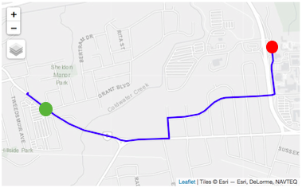
```

Most participants reported being familiar with this route; they had previously cycled at least part of the route or in this general area. The majority of participants disliked the segments with a four-lane arterial road that lacked infrastructure, and more than half stated that they would not cycle this part of the route. Factors that made them dislike these segments include the lack of cycling facilities, number of traffic lanes, the width of the lanes, and the hilliness (see Figures 3 and 4). Most participants expected car traffic to be moving faster on these segments.

```{r figure-3, echo=FALSE, fig.align = 'center', out.width = "0.65\\linewidth", fig.show = "asis", fig.cap = "Segment 2 of route 1A depicting two or three lanes in each direction and no cycling facilities on the roadway. Lighting and natural views are present. (Source: Google Street View)"}
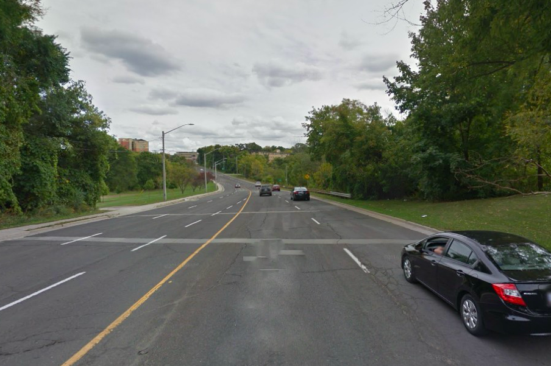
```

```{r figure-4, echo=FALSE, fig.align = 'center', out.width = "0.65\\linewidth", fig.cap = "Segment 2 of route 1A depicting the uphill section on a 2 lane arterial road with no on-street cycling infrastructure. (Source: Google Street View)"}
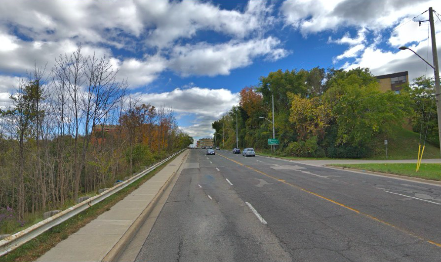
```

A few participants who were familiar with the area reported that they would have cycled the Hamilton-Brantford Rail Trail instead, an off-street multi-use trail parallel to the arterial road. Some cyclists noted that there was no sidewalk or shoulder on the right side of the roadway where they would be cycling, with some describing that it would make them feel “*uncomfortable*” or “*anxious*” without that space. In general, the arterial road without infrastructure was perceived to be too busy and not designed for cycling. The left turn at an unsignalized intersection was also noted as difficult by a few participants (see Figure 5).

```{r figure-5, echo=FALSE, fig.align = 'center', out.width = "0.65\\linewidth", fig.show = "asis", fig.cap = "Segment 4 of route 1A depicting the urban design of the street when making a left turn to follow the City's signed bicycle route. (Source: Google Street View)"}
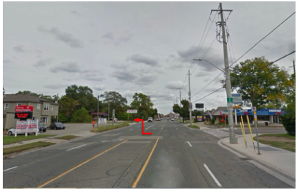
```

However, the route was generally perceived positively once it entered a residential area. The majority of participants reported liking or had positive comments of the segments that had an on-street marked bicycle lane (see Figure 6). Most participants also liked these segments because they were perceived to be “*residential*” or “*quiet*”, and not as busy in terms of car volume. Some participants reported liking the green space and nature along the on-street marked bicycle lane. In addition, half of the participants stated that they liked the pedestrian-activated traffic signal because it enabled them to cross the arterial road promptly and safely (see Figure 7).

```{r figure-6, echo=FALSE, fig.align = 'center', out.width = "0.65\\linewidth", fig.show = "asis", fig.cap = "Segment 9 of route 1A depicting the on-street marked bicycle lane in a residential neighbourhood. (Source: Google Street View)"}
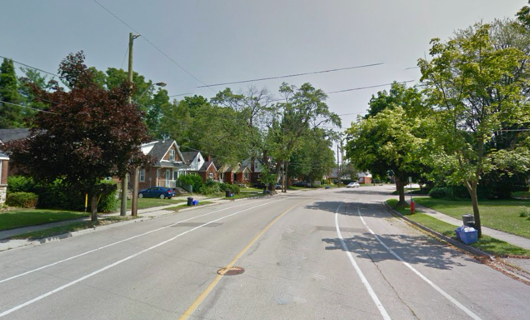
```

```{r figure-7, echo=FALSE, fig.align = 'center', out.width = "0.65\\linewidth", fig.show = "asis", fig.cap = "Segment 13 of Route 1A depicting a pedestrian-activated signal to cross a an arterial road. (Source: Google Street View)"}
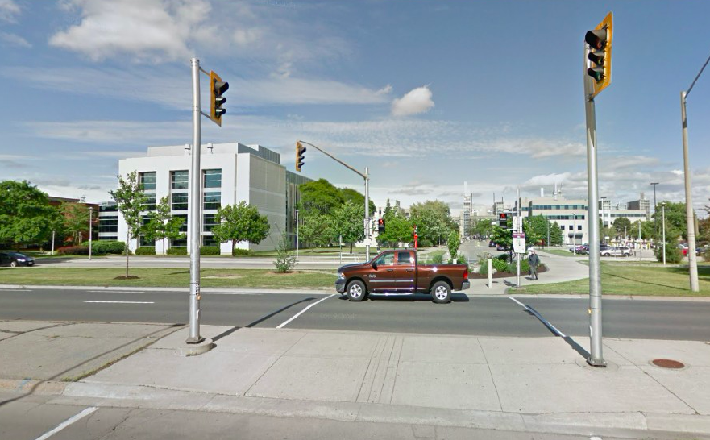
```

#### Route 1B

```{r figure-8, echo=FALSE, fig.align = 'center', out.width = "0.65\\linewidth", fig.show = "asis", fig.cap = "Map of route 1B."}
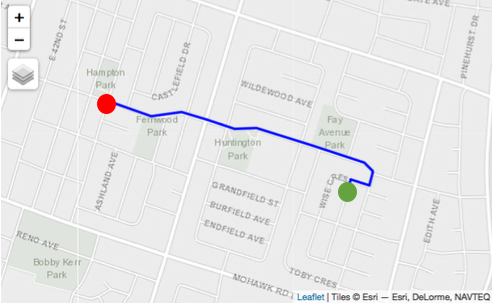
```
While none of the participants were familiar with this route, this route received overall positive comments. Cyclists primarily liked the route because it was perceived to have low traffic, fewer cars, and was quiet or residential. Some words used to describe the route include “*nice*”, “*lots of trees*”, and “*not busy*” (see Figure 9). The lack of infrastructure was noted by some participants but only two reported that they disliked this aspect of the route. Only one participant noticed that it was a signed route, but participants reported that they would generally feel comfortable cycling this route. A few participants commented on the good quality of the pavement. Although the route was perceived to be low traffic and residential, some cyclists would still have preferred if the route had a dedicated cycling facility. Four participants noticed or liked the 40 kilometres/hour speed limit on the route. 

```{r figure-9, echo=FALSE, fig.align = 'center', out.width = "0.65\\linewidth", fig.show = "asis", fig.cap = "Segment 4 of route 1B depicting the streetscape on a signed route in a residential area. (Source: Google Street View)"}
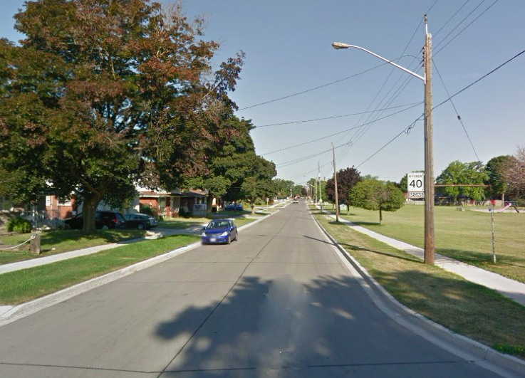
```

### Package 2

#### Route 2A^[This route was slightly adjusted for the audit. CycleStreets inferred that cyclists would cross midblock at an unsignalized intersection towards the end of the route. Cyclists have been found to be sensitive to intersections @broachWhereCyclistsRide2012. Therefore, the audited route was adjusted to a parallel street one block east that would enable a cyclist to cross at a signalized intersection.]

```{r figure-10, echo=FALSE, fig.align = 'center', out.width = "0.65\\linewidth", fig.show = "asis", fig.cap = "Map of route 2A."}
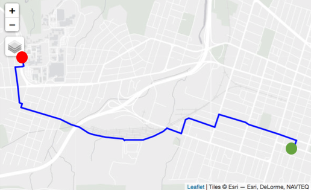
```
Participants were familiar with this route and had previously cycled the entire route or parts of it. Cyclists reported liking the infrastructure, particularly the on-street marked bicycle and the Hamilton-Brantford Rail Trail, which is an off-street multi-use path (see Figure 11 and Figure 12). The Rail Trail was perceived to be ideal for cycling: one participant called it a "*superhighway for bicycles*", another described it as a fundamental “*arterial route*” for cyclists in Hamilton. Most participants also liked that many sections of the route that did not have dedicated infrastructure were on residential streets. Several cyclists liked or noticed that the route connected them to or passed by key destinations.

```{r figure-11, echo=FALSE, fig.align = 'center', out.width = "0.65\\linewidth", fig.show = "asis", fig.cap = "Segment 5 on route 2A depicting an on-street marked bicycle lane on a one-way street with one lane going westward. (Source: Google Street View)"}
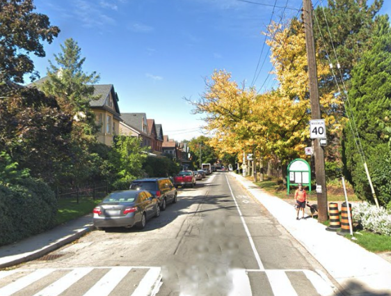
```

```{r figure-12, echo=FALSE, fig.align = 'center', out.width = "0.65\\linewidth", fig.show = "asis", fig.cap = "Segment 18 of route 2A depicting the off-street multi-use path called the Hamilton Brantford Rail Trail. (Source: Google Street View)"}
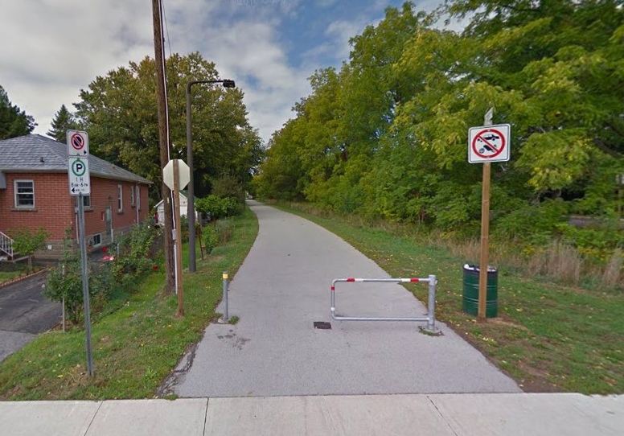
```

There were four areas or features along the route that participants disliked or that were more poorly perceived. First, several participants disliked or expressed concern about turning left at an intersection without a signal after the bike lane ends. Cyclists who disliked this feature reported often waiting a while to turn left, that it was challenging for them that motorists did not always anticipate their need to transition lanes like other road users, or that they were not given enough space (see Figure 13).

```{r figure-13, echo=FALSE, fig.align = 'center', out.width = "0.65\\linewidth", fig.show = "asis", fig.cap = "Segment 8 of route 2A depicting the buffered bicycle lane ending and the transition that a cyclist would have to make to get into the left-turn lane. (Source: Google Street View)"}
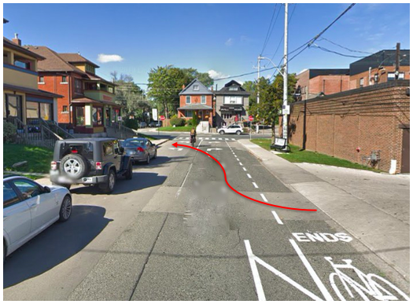
```

Second, the short stretch along an arterial road with two traffic lanes in each direction and no dedicated cycling infrastructure (see Figure 14) was strongly disliked by most participants. Others had mixed perceptions or experiences or reported being fine cycling on a short stretch of this road. Those who strongly disliked the arterial road reported avoiding this street as much as possible or preferred to cycle on the sidewalk instead. For example, the arterial road was perceived to be a “*speedway*” and an area that had “*a lot of car entitlement*”. Next, the left turn at a signalized intersection from an arterial road to a street with sharrows was disliked or concerning for some participants (see Figure 15). Many participants noted that they used an alternate route to get to the Rail Trail to avoid this arterial road and intersection entirely.

```{r figure-14, echo=FALSE, fig.align = 'center', out.width = "0.65\\linewidth", fig.show = "asis", fig.cap = "Segment 14 of route 2A depicting an arterial road without on-street cycling infrastructure. (Source: Google Street View)"}
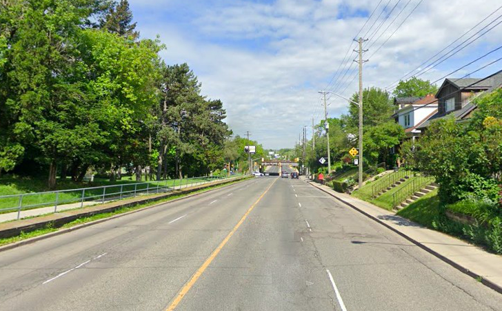
```

```{r figure-15, echo=FALSE, fig.align = 'center', out.width = "0.65\\linewidth", fig.show = "asis", fig.cap = "Segment 14 of route 2A depicting a signalized intersection where a cyclist would turn left on to a street with sharrows to travel to the Hamilton-Brantford Rail Trail. (Source: Google Street View)"}
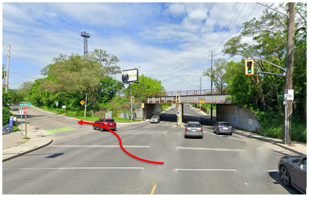
```

Finally, most cyclists stated that they disliked an intersection at the end of the route that would require them to transition from a residential to arterial road (see Figure 16). The area was viewed as very busy or “*not fluid*” by some participants because there was an off-street multi-use path parallel to the road on the left side of the roadway that could not be accessed swiftly from the right side. However, several participants reported that they would have taken an alternate route to access the university campus from another entrance.

```{r figure-16, echo=FALSE, fig.align = 'center', out.width = "0.65\\linewidth", fig.show = "asis", fig.cap = "Segment 29 of route 2A depicting the intersection of a residential road and two arterial roads. (Source: Google Street View)"}
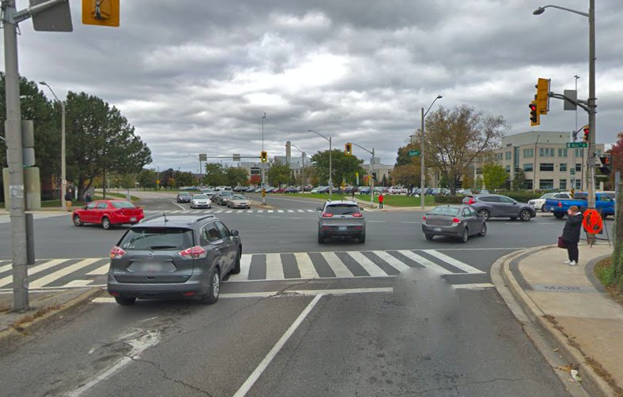
```

#### Route 2B

```{r figure-17, echo=FALSE, fig.align = 'center', out.width = "0.65\\linewidth", fig.show = "asis", fig.cap = "Map of route 2B."}
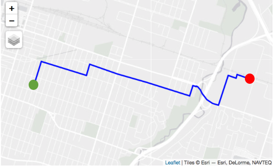
```

Some cyclists reported that they were familiar with this route or that they had previously cycled part of the route. The participants commented that there was a mix of features of the route that they liked and disliked. The segments along the route that were perceived to be "*quiet*" or "*residential*" were liked by most participants because car volume and speed were perceived to be lower (see Figure 18). The protected off-street multi-use trail over the highway was another feature that most participants liked or that elicited positive comments (see Figure 19). In general, the segments that were perceived to not be busy with traffic were liked or participants reported feeling comfortable cycling there, but the segments where car volume or speed were perceived to be higher were disliked. 

```{r figure-18, echo=FALSE, fig.align = 'center', out.width = "0.65\\linewidth", fig.show = "asis", fig.cap = "Segment 11 of route 2B depicting a residential area. (Source: Google Street View)"}
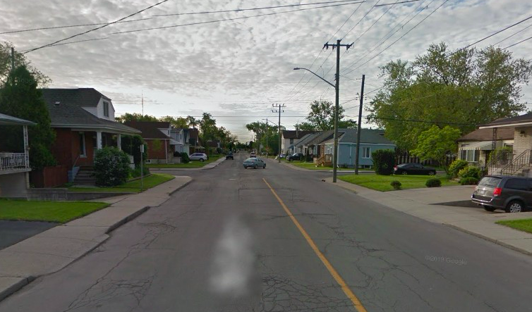
```

```{r figure-19, echo=FALSE, fig.align = 'center', out.width = "0.65\\linewidth", fig.show = "asis", fig.cap = "Segment 30 of route 2B depicting the protected multi-use trail on the right side of the roadway on an arterial road over the Red Hill Valley Parkway. (Source: Google Street View)"}
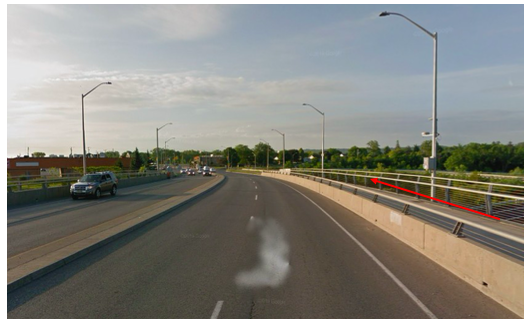
```

Some cyclists had mixed perceptions about the width of some of the segments (see Figure 20 and Figure 21). A few participants commented that at times there appeared to be enough space for motorists to safely pass cyclists, while others perceived the wide streets to potentially invite speeding. Anticipated car volume and the presence of on-street parking along these segments seemed to influence perceptions about the width of the street and comfortability. Cyclists preferred to have space for a motorist to safely pass. Most participants noticed or disliked the poor condition of the road along parts of the route. Finally, participants reported that they disliked the end of the multi-use trail or having to cycle on an arterial road and cross four lanes to make a left turn (see Figure 22).

```{r figure-20, echo=FALSE, fig.align = 'center', out.width = "0.65\\linewidth", fig.show = "asis", fig.cap = "Segment 14 on route 2B depicting a two-lane arterial road with on-street parking. (Source: Google Street View)"}
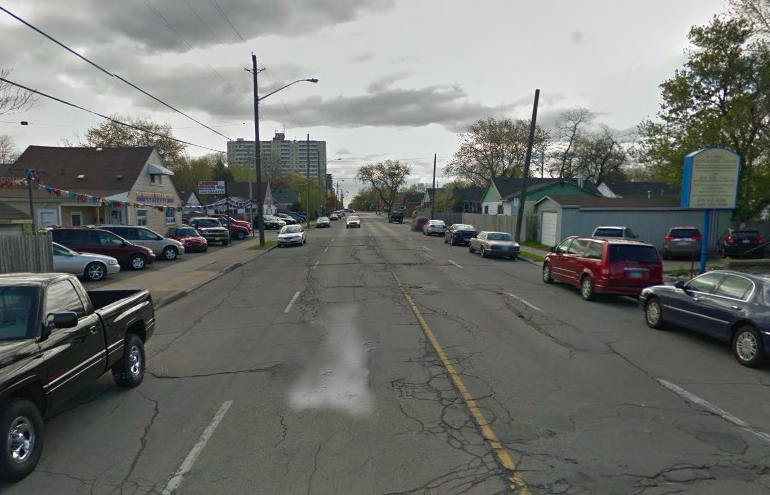
```
```{r figure-21, echo=FALSE, fig.align = 'center', out.width = "0.65\\linewidth", fig.show = "asis", fig.cap = "Segment 20 on route 2B depicting a two-lane arterial road with no on-street parking and a wide grassy verge on the right side of the roadway. (Source: Google Street View)"}
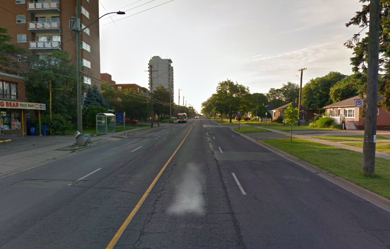
```

```{r figure-22, echo=FALSE, fig.align = 'center', out.width = "0.65\\linewidth", fig.show = "asis", fig.cap = "Segment 31 of route 2B depicting a lane change from the far right side of the roadway to the left-turn lane on a four-lane arterial road. (Source: Google Street View)"}
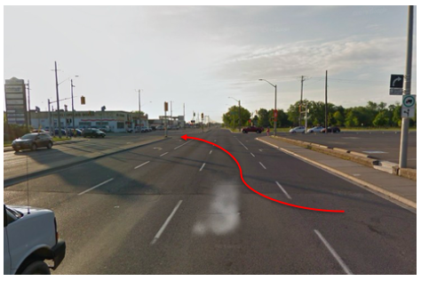
```

### Package 3

#### Route 3A^[This route was slightly adjusted for the audit. The starting point was midblock on a residential street. The audit started instead at the nearest intersection along the route.]

```{r figure-23, echo=FALSE, fig.align = 'center', out.width = "0.65\\linewidth", fig.show = "asis", fig.cap = "Map of route 3A."}
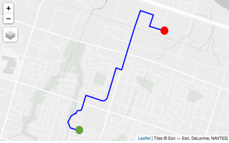
```

None of the participants had cycled in this area or were familiar with this route. The opposite to Route *1A*, participants liked the first half of the route and generally disliked features of the second half. The beginning of the route was in a residential area; most cyclists reported that they liked the quiet streets and good road condition (See Figure 24). The lower speed limit of 40 kilometres/hour was noticed by several participants and some commented that they like travelling on streets with this speed limit. Once the route left the residential area about mid-way, most participants disliked turning to or cycling on a two-lane arterial road without infrastructure. The arterial road leading towards the industrial was perceived by some cyclists to be designed for cars (see Figure 25 and Figure 26). One participant described this as, “*you’re just out on a bike in the middle of the highway*”. The route ended in an industrial area which received mixed perceptions; some cyclists commented that traffic volume did not appear to be too heavy in the photos while many others reported feeling less comfortable cycling in an area where they could expect a lot of trucks.

```{r figure-24, echo=FALSE, fig.align = 'center', out.width = "0.65\\linewidth", fig.show = "asis", fig.cap = "Segment 2 of route 3A depicting a residential street. (Source: Google Street View)"}
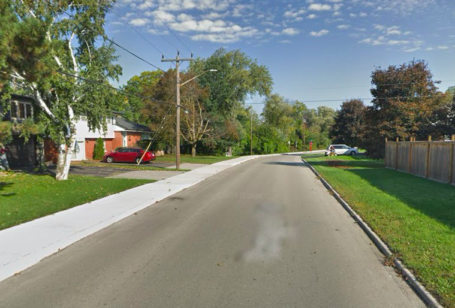
```

```{r figure-25, echo=FALSE, fig.align = 'center', out.width = "0.65\\linewidth", fig.show = "asis", fig.cap = "Segment 13 of route 3A depicting a two-lane arterial road without cycling facilities in a residential area. (Source: Google Street View)"}
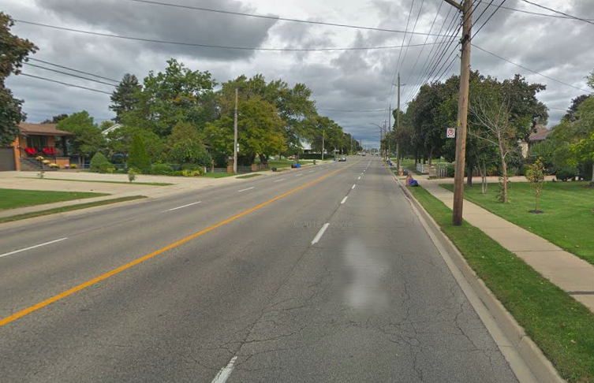
```

```{r figure-26, echo=FALSE, fig.align = 'center', out.width = "0.65\\linewidth", fig.show = "asis", fig.cap = "Segment 15 of route 3A depicting a two-lane arterial road without cycling facilities or a sidewalk leading to a more industrial area. (Source: Google Street View)"}
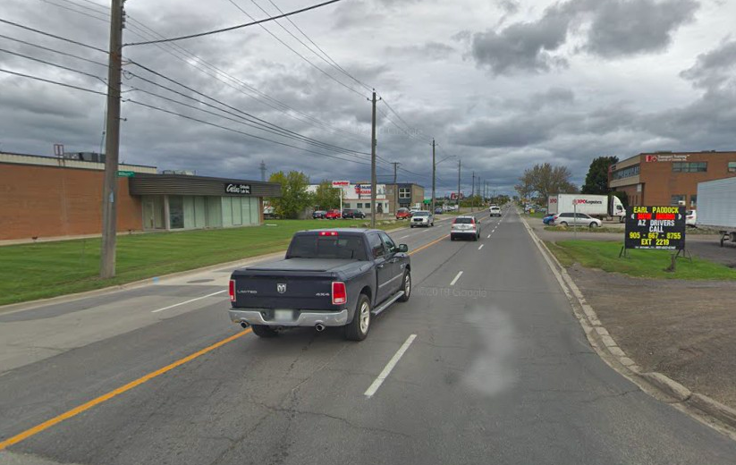
```

#### Route 3B^[This route was slightly adjusted for the audit. Rather than starting midblock on an uphill access to the escarpment, which would be an unlikely origin, the audit started two blocks south. Recall that the origin of each inferred route is the centroid of the traffic analysis zone, so this is not the true origin of this cycling flow.]

```{r figure-27, echo=FALSE, fig.align = 'center', out.width = "0.65\\linewidth", fig.show = "asis", fig.cap = "Map of route 3B."}
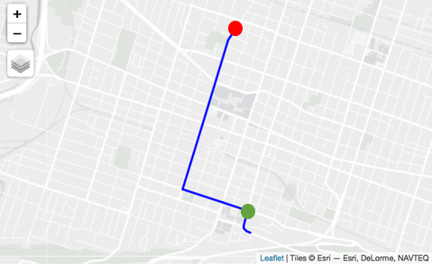
```

This route was familiar to the participants and the majority had cycled at least part of it. Cyclists liked that the majority of the route had cycling infrastructure (see Figure 28 and 29). The first few segments at the beginning of the route were perceived to be busy in terms of traffic by several participants, but many noted that people drive slower near the hospital.

```{r figure-28, echo=FALSE, fig.align = 'center', out.width = "0.65\\linewidth", fig.show = "asis", fig.cap = "Segment 4 on route 3B with a buffered on-street bicycle lane on a one-way street. (Source: Google Street View)"}
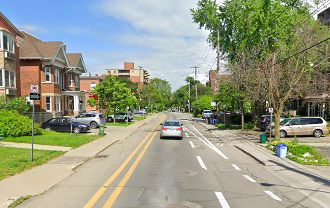
```

The two-way cycle track (see Figure 29) was generally perceived well and elicited a lot of comments from participants, likely because they reported using it. However, participants expressed a mix of appreciation and frustration about this “*major cycling infrastructure*”. Several participants reported that they had witnessed people drive or park in the lanes, as well as drift into them to avoid passing closely to the parked cars in the outer right lane. Many participants expressed a desire to have enhanced protection along these facilities. Three participants, one travelling with a young child, reporting being hit by a motorist who was turning left across the cycle track. Others reported being vigilant when using this infrastructure because it is a two-way facility on a one-way street. Despite it being a relatively new and important North-South route in the city’s cycling network, cyclists described that it needed improvements in particular areas that were conflict points with other road users.

```{r figure-29, echo=FALSE, fig.align = 'center', out.width = "0.65\\linewidth", fig.show = "asis", fig.cap = "Segment 8 on route 3B depicting a two-way cycle track on a one-way arterial road. (Source: Google Street View)"}
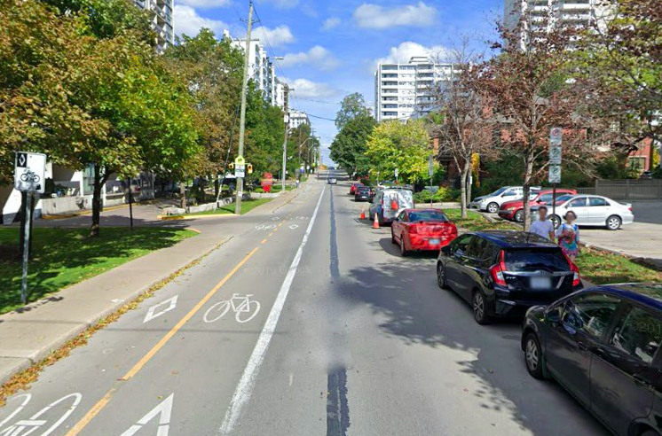
```

There were also mixed comments about a few intersections along the route that had bike boxes. Most cyclists reported that this infrastructure could be confusing, both for them and for motorists, and that sometimes motorists park in them if the light is red (see Figure 30). However, others reported that they liked the bike boxes and find them useful for transition points. The route was also perceived to be disconnected or disjointed by some participants; these comments were in reference to the different or inconsistent types of infrastructure along the route and because the infrastructure ends or is missing at certain spots.

```{r figure-30, echo=FALSE, fig.align = 'center', out.width = "0.65\\linewidth", fig.show = "asis", fig.cap = "Segment 20 of route 3B depicting the bike box at the intersection of two cycling facilities. After the intersection, the two-way cycle track on the left side of the roadway splits to on-street bicycle lanes on both sides of the road. (Source: Google Street View)"}
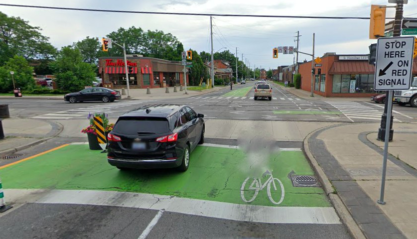
```

## Preferred Routes

After reviewing each of the three packages of photos, participants were asked to select which of the two routes in each package they preferred. All participants consistently selected the same routes: *1B* was preferred over *1A*, *2A* over *2B*, and *3B* over *3A*. In the first package, cyclists preferred route *1B* because they disliked the first three segments of *1A*. Cycling on route *1B* on residential streets was preferred over negotiating shared space on a busy four-lane arterial road even though there were dedicated cycling facilities later in the route. It is worth noting that a few participants commented that they most preferred the second half of *1A* because it had an on-street marked bicycle lane, but that *1B* was a better route overall. In the second package, participants preferred *2A* because it had cycling infrastructure throughout compared to *2B* which had a signed route only for part of it. *2A* was also familiar to most participants. Finally, *3B* was preferred for similar reasons that *2A* was preferred; there were on-street cycling facilities for most of the route and it was familiar to most participants.

Discussion {#sec:discussion}
======================================

The environmental audits revealed that each of the routes had a mix of attributes that support or hinder cycling. This can be expected in a city with a cycling network under development. The audits helped to explain why certain trip flows were over- or under-estimated by the model [paper submitted to *Transportation*]. All inferred routes included residential streets with lower volumes of cars or cycling infrastructure. With respect to the routes that were under-estimated (i.e., *1B*, *2B*, *3A*, and *3B*), there were many features that might influence cycling. For instance, two of the four (i.e., *2B* and *3B*) had some type of separated cycling facility. Three of the four routes (i.e., *1B*, *2B*, and *3A*) included residential streets. Based on the routes audited, we observed that the *CycleStreets* algorithm makes sensible recommendations that a knowledgeable cyclist could take. Indeed, three of the six routes (*1A*, *2A*, and *3B*) were familiar to or had been previously cycled by many participants. This suggests that the inferred routes do match where cyclists actually travel in Hamilton. 

Participants preferred routes that visibly accommodate cycling, and their route and infrastructure preferences align with previous literature. They preferred cycling facilities and streets with lower levels of traffic, which has been found in many other studies [*inter alia*, see @buehlerBikewayNetworksReview2016b; @clarkUserPreferencesBicycle2019a; @mertensBuiltEnvironmentalCorrelates2017; @wintersMotivatorsDeterrentsBicycling2011]. Participants were also sensitive to traveling through intersections [@broachWhereCyclistsRide2012] and many enjoyed routes that had natural features [@marquartPlannedPerceivedCity2020; @wintersMotivatorsDeterrentsBicycling2011]. Perceived car volume was another factor that participants frequently commented on as they reviewed photos, likely because cyclists are known to be sensitive to busy traffic [@segadilhaIdentificationFactorsThat2014a] and are motivated to cycle if there are routes away from cars [@wintersMotivatorsDeterrentsBicycling2011]. Cyclists in Hamilton describe similar experiences to those who cycle in Waterloo, Ontario [@mayersWhoseLaneIt2020], which suggests that a pattern of exclusion may currently exist in mid-sized cities as they grapple with a tension between transport culture and new interventions. Finally, participants also considered a range of factors beyond infrastructure to determine whether a street or route sufficiently meets their needs and preferences, which is useful information for policy-makers and transport planners. Many participants reported that they like to cycle on roads with smooth or good conditions, which has previously been reported in the literature [@stinsonCommuterBicyclistRoute2003]. Some cyclists preferred to have lateral space to their right, like a sidewalk or some other “*escape zone*”, in the event that they needed to quickly move out of the way. These attributes may be overlooked by transport planners but should be considered when planning cycling networks and routes.

The temporal aspect of our photo elicitation approach also revealed that there is a threshold of unpleasantness that cyclists are willing to tolerate along a route. In the case of route *1A*, the segments along the arterial road without infrastructure were such strong deterrents that cyclists preferred the other unfamiliar residential route. Although *1A* was inferred and not one that participants reported using, someone who is new to cycling but unfamiliar with other routes could likely consider this to be the most direct route. The photo activity underscored that the fragmented nature of the cycling network in a developing cycling city can create barriers for accessing bikeable streets. This reinforces the importance of connected facilities in encouraging cycling [@buehlerBikewayNetworksReview2016b; @handyMakingUSCities2020; @yangCyclingfriendlyCityUpdated2019] and that navigating mixed traffic in cities where there is less infrastructure is perceived to be less safe [@chatawaySafetyPerceptionsReported2014]. More importantly, these streets are not separate from the rest of the transport system and the ability to reach this infrastructure matters. If getting to on-street cycling facilities is perceived to be challenging or too dangerous, then regular and even potential cyclists may be unwilling to use existing infrastructure or avoid routes that incorporate these streets altogether. 

## Policy Implications

There are three important implications of this study for developing cycling cities: i) the perceptions of cyclists should be regularly explored and incorporated in route design; ii) the timing of incorporating cyclists’ feedback is important for ensuring that infrastructure is functional and adapted as it grows; and iii) using photo elicitation is an innovative and practical approach for planning practice.

Although our approach differed from other studies where participants took photos themselves [@bornioliPsychologicalWellbeingBenefits2018; @guellPicturingCommutingPhotovoice2015; @wardInfluenceTransportWellbeing2015], the photo activity was illuminating because it helped participants recall their experiences and revealed rich insights about cycling behaviours and perceptions. This evidence could not have been derived from a travel survey or cycle routing algorithm. This is one of the benefits of using photos to elicit dialogue because they "evoke deeper elements of human consciousness than do words" [@harperTalkingPicturesCase2002]. Therefore, it is recommended that developing cycling cities routinely examine cycling perceptions through qualitative data like photo elicitation to centre the experience of cycling in the design of infrastructure and routes. This data can also be useful for mobile applications based on crowdsourced data or digital platforms that incorporate cyclists' informal routes to inform future cycling route and new locations for infrastructure [see @cellinaCocreatingAppbasedPolicy2020; @meirelesDigitalPlatformMobile2020]. Users can describe how particular routes or types of infrastructure are actually experienced and travelled, both to communicate preferred routes to other cyclists and to highlight necessary improvements to planners. The use of photos can extend current planning practices beyond simple identification of problem areas by describing how cyclists navigate these spaces. 

Furthermore, inviting cyclists to have a more regular participatory role in route design and planning as the cycling network develops is an important practice. Failing to understand and integrate cyclists' perceptions and preferences in planning early on in a city's cycling network development can negatively impact efforts to increase cycling; resources could be spent on facilities that are fundamentally unappealing to cyclists or other barriers can be ignored. Taking advantage of cyclists’ expertise in developing cycling cities can help to overcome the barrier of a lack of safe cycling routes, a barrier identified in another "low cycling maturity" city by Félix et al. [-@felixMaturingUrbanCycling2019]. Marquart et al.’s [-@marquartPlannedPerceivedCity2020] study highlights that planners “are determining the characteristics of routes in urban areas”, which supports our recommendation that more opportunities be created for cyclists to share feedback. Without such opportunities, tools can be developed that only reflect the designers' perceptions and that fail to account for the needs of other cyclists like women [@xieWonCycleRoute2018]. Participants’ comments about the bike boxes, a relatively new cycling intervention in Hamilton, is one example of how the use of photos and detailed feedback can be informative for transport planners. Likewise, new or potential cyclists also have specific preferences and their perceptions should be explored through similar approaches. In addition to our methods, other mapping techniques [see @mantonUsingMentalMapping2016; @marquartPlannedPerceivedCity2020], ride-along activities [see @vanduppenRetracingTrajectoriesEmbodied2013], and frequent audits before and after next infrastructure is built may be further informative for understanding how cyclists navigate developing cycling cities. 

Finally, transport planners in developing cycling cities, like Hamilton, should make every effort to focus beyond infrastructure and seek to better integrate these individual links within a transport system that is designed with pro-cycling policies in mind. Studies have provided evidence that cities that are most successful in increasing their cycling trips and levels have implemented a suite of interventions to change behaviour and the built environment [@pucherInfrastructureProgramsPolicies2010a; @pucherBicyclingRenaissanceNorth2011a]. Our findings support the recommendation that the City of Hamilton explore and implement bolder policies to encourage modal shifts. There is strong incentive for prioritizing cycling more: 35% of all current trips in Hamilton could be cycled [@Mitra2016] and more people could benefit from increased physical activity.

Study Limitations {#sec:limitations}
=======================================

There are some instances where the *CycleStreets* algorithm failed to include some of the city's off-street cycle infrastructure or signed routes. Some participants noted these situations and described alternate detours that are more locally known. This highlights that a routing algorithm may not reflect the extent or range of behaviours of cyclists. However, many routes were familiar to participants so we find that the algorithm makes sensible recommendations. Although the photos of the routes were taken from Google Street View and may not reflect prime cycling times and likely traffic volumes expected at those times, there were no errors or differences pointed out by participants along routes familiar to them.

Furthermore, several cyclists noted that the routes they preferred were familiar to them, which suggests that familiarity played a role in their decision. This makes sense because it affords them more intimate knowledge of the route. Therefore, our findings could have been different if the participants were familiar with all of the routes or if they were familiar with none. However, their familiarity offered insightful information about how these road spaces are actually experienced which is useful for transport planners in Hamilton. Our findings would also likely have been different if the participants were new or occasional cyclists. Less experienced cyclists are likely to have even stronger preferences for protected infrastructure and be more averse to mixing with traffic [@wintersMotivatorsDeterrentsBicycling2011]. The findings may not match the preferences or experiences of other cyclists such as older adults, women who are more conscious of traffic risks, children, or marginalized groups. These individuals have unique needs with respect to separation from traffic and perceptions of the built environment, as well as different trip patterns [*inter alia* see @aldredAdultsAttitudesChild2015; @blackPowerPerceptionsExploring2014a; @emondExplainingGenderDifference2009]. 

Finally, some photos taken from Google Street View were darker or cloudier than others. This was noticed by some participants, suggesting that it may have subconsciously influenced participants' perceptions. However, there was similarity in participants' stated preferences and all selected the same preferred routes. This suggests the weather depicted in the photos likely had less of an influence on individual perceptions and preferences, and that attributes of the routes and familiarity were more important.

Conclusion {#sec:conclusion}
======================================

Through environmental audits and a photo activity in semi-structured interviews we demonstrated that cycling routes in Hamilton have a mix of attributes that support and hinder cycling. The interviews with regular cyclists revealed that they prefer routes that have dedicated cycling infrastructure or streets with low volumes of traffic, and that existing infrastructure needs to be adapted to better align with cyclists' needs and preferences. As a developing cycling city with 46% of the cycling network completed, the findings from this study will be useful to policy-makers and transport planners in Hamilton, and other mid-sized cities with growing cycling levels, to design more bicycle-friendly streets and facilitate more trips that enable people to be physically active. Our findings support the recommendation that other developing cycling cities involve local cyclists to inform infrastructure design and location and pay attention to a broad range of built environment factors that influence where people choose to cycle. The use of photos to explore cyclists' perceptions and experiences is a promising participatory approach that can be incorporated into planning practice to complement travel survey data and better centre the cycling experience in cycle infrastructure and route design.


Acknowledgments {#sec:acknowledgments}
======================================

The authors wish to express their sincere gratitude to the participants of the study who shared their time and stories. The authors also wish to thank the research assistants for their assistance in collecting data and conducting the environmental audits. In addition, the following `R` packages were used in the course of this investigation and the authors wish to acknowledge their developers:  `cyclestreets` [@Lovelace2018], `dplyr` [@R-dplyr], `float` [@R-float], `forcats` [@R-forcats], `ggplot2` [@R-ggplot2], `ggthemes` [@R-ggthemes], `kableExtra` [@R-kableExtra], `knitr` [@R-knitr], `ngram` [@R-ngram], `purrr` [@R-purrr], `readr` [@R-readr], `rticles` [@R-rticles], `sf` [@R-sf], `sp` [@R-sp], and `spdep` [@R-spdep].

CRediT Statement {#sec:credit}
======================================

**First author**: conceptualization, methodology, investigation, formal analysis, data curation, writing - original draft, writing - review & editing. **Second author**: conceptualization, methodology, writing - original draft, writing - review & editing. **Third author**: conceptualization, writing - original draft, writing - review & editing. **Fourth author**: conceptualization, writing - original draft, writing - review & editing. **Fifth author**: conceptualization, methodology, writing - original draft, writing - review & editing, supervision.


References {#sec:references}
=======================================


